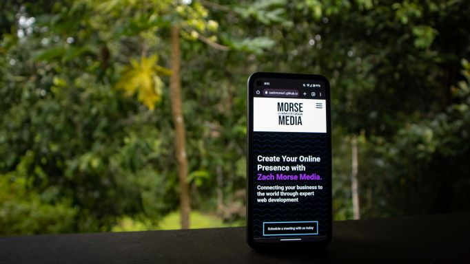

# responsive-agency-website

🔗 **Live site:**  
https://zachmorse1.github.io/responsive-agency-website/

---

## Overview

### Mobile View

This project is a fully responsive website built as part of a real-world web design experiment. The goal was to design, build, and deploy a client facing website while gaining practical experience with modern frontend frameworks, responsiveness, and real world constraints.

The business itself is no longer active, but the project remains as a technical and learning reference.

---

## Key Features

- Responsive, mobile-first layout
- Semantic HTML structure for accessibility and SEO
- Custom CSS styling with consistent visual hierarchy
- Interactive elements using basic JavaScript
- Integrated third-party tools for real-world functionality

---

## Technical Highlights

- **HTML & CSS**  
  Structured semantic markup with responsive layouts optimised for different screen sizes.

- **Mobile-first design**  
  Layout and styling prioritise smaller devices before scaling up to ensure responsiveness.

- **JavaScript interactivity**  
  Used for UI behaviour such as FAQ toggles and interactive elements.

- **SEO & analytics considerations**  
  Includes metadata, canonical links, and Google Analytics integration.

- **Accessibility tooling**  
  Accessibility widget integrated to explore inclusive design considerations.

- **Third-party integrations**  
  Embedded tools such as Calendly and chat widgets.

---

## What I Learned

- Designing for real world problems versus theoretical requirements
- Balancing visual design with usability and performance
- Structuring a static site for maintainability
- Managing third-party scripts responsibly
- Deploying and maintaining a live site

---

## What I Would Improve Next

- Refactor CSS into a more modular structure
- Optimise performance by reducing third-party script impact
- Introduce a lightweight build process for scalability
- Build in a CMS so blogs can be managed automatically

---

## Running the Project Locally

This is a static website.

1. Download or clone the repository
2. Open `index.html` in your browser

No build tools or dependencies are required.

---

## Notes

This repository is intended as a technical portfolio project.  
Client names, testimonials, and commercial materials have been removed to maintain clear professional boundaries.

---

## Author

**Zach Morse**  
Computer science student at QUT building small, real-world projects.
